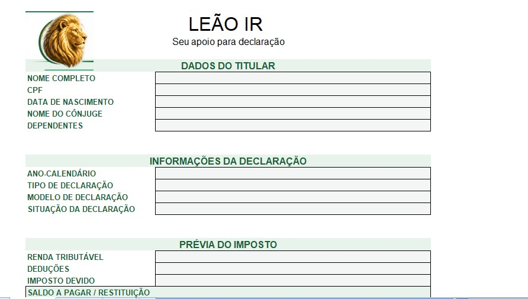
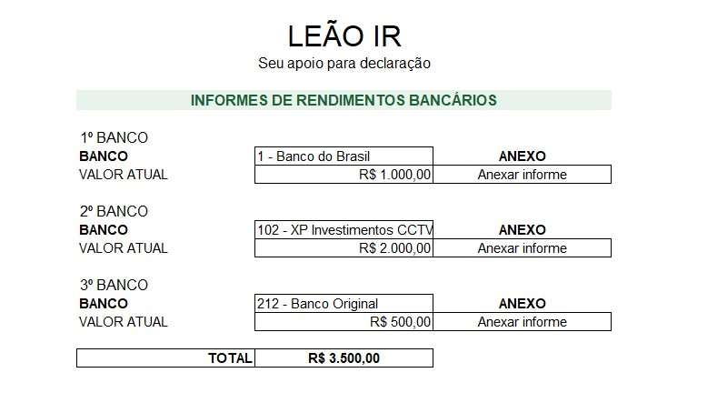

# LEÃO IR — Seu apoio para declaração

## 📌 Sobre o projeto

O **LEÃO IR** é uma aplicação desenvolvida em Excel para apoiar a organização de informações utilizadas na preparação da declaração de Imposto de Renda.

A proposta é oferecer uma interface simples, visual e prática para reunir dados do titular, informes bancários, receitas, deduções e uma estimativa de imposto.

## 🎯 Objetivo

Facilitar a organização das informações da declaração, permitindo que o usuário:

- Registre seus dados pessoais;
- Organize informes de rendimentos;
- Registre receitas e deduções;
- Acompanhe uma estimativa de imposto a pagar ou restituição;
- Mantenha os documentos relacionados reunidos no mesmo arquivo.

## ✨ Funcionalidades

### TITULAR
Cadastro de informações pessoais, como:

- nome completo;
- CPF;
- data de nascimento;
- nome do cônjuge;
- dependentes;
- tipo de declaração.

### INFORMES
Área para organização de informes de rendimentos bancários, com:

- cadastro de bancos;
- registro de valores;
- espaço para anexos em PDF;
- totalização dos valores informados.

### NOTAS
Área para lançamento e acompanhamento de:

- receitas;
- categorias de rendimentos;
- valores;
- renda tributável;
- deduções;
- estimativa de imposto;
- saldo a pagar ou restituição.

## 🗂️ Estrutura do arquivo

- **TITULAR** — dados do titular e informações da declaração.
- **NOTAS** — lançamentos e estimativa.
- **INFORMES** — rendimentos bancários e documentos.
- **AUXILIAR** — listas de apoio e validações; permanece oculta para o usuário final.

## 🛠️ Tecnologias utilizadas

- Microsoft Excel;
- fórmulas e validação de dados;
- formatação de células;
- navegação entre abas;
- organização visual de aplicações;
- inserção de documentos em PDF.

## ⚠️ Aviso importante

Os valores apresentados pelo LEÃO IR são **estimativas para fins de organização e apoio**. Eles não representam o resultado oficial da Receita Federal e não substituem a conferência dos documentos nem a declaração oficial.

## 👩‍💻 Autoria

Projeto acadêmico desenvolvido para fins de desenvolvimento e demonstração de aplicação prática em Excel.
